## Concatenated adata file with no integration
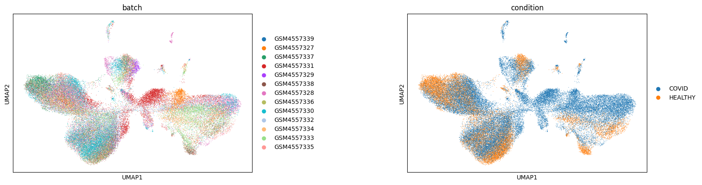

## SCVI Latent Space Representation
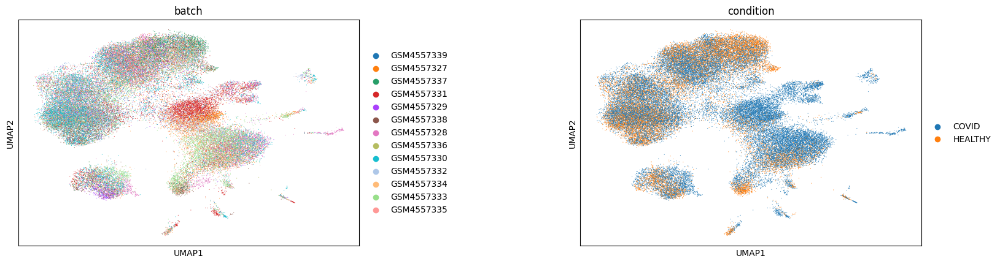

## SCANVI Latent Space Representation
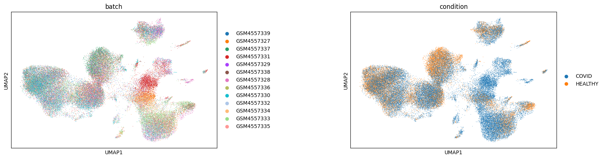

## Healthy Samples Before Filtering
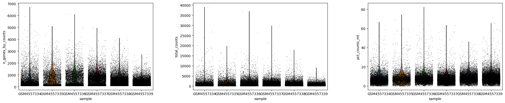

## Healthy Samples After Filtering
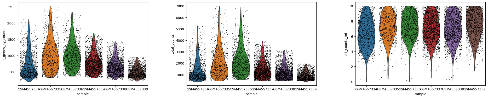

## COVID Samples Before Filtering
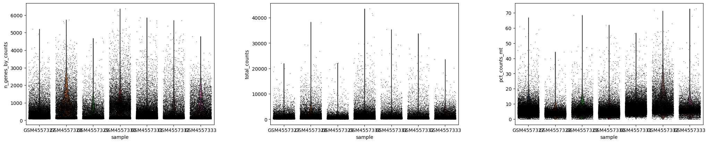

## COVID Samples After Filtering
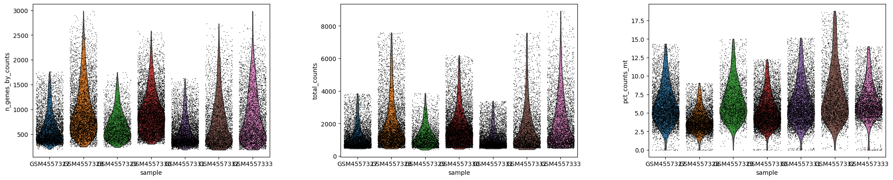

## UMAP Of Leiden Resolutions From 0.5 to 1.25
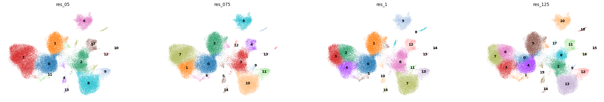

## Dotplot Of Top Marker Genes
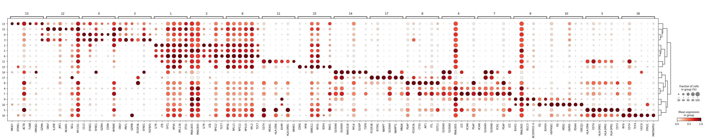

## Automated Labelling with CellTypist
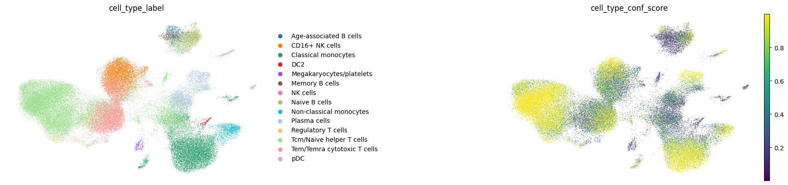

## Manual Cluster Labeling
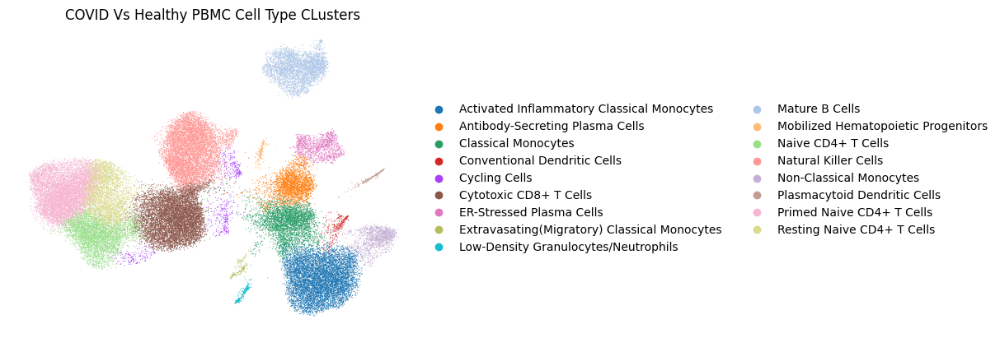

